# Metamask 101

This post introduces [Metamask](https://metamask.io), how to install it in different browsers, add Ethereum (ETH) to a test account, and explore first interactions with a Web3 application.

## Why Use Metamask?

How do you connect regular users to DApps? Can you interact with the Ethereum blockchain in an intuitive and user-friendly manner? Metamask set out with a mission "make Ethereum as easy to use for as many people as possible." Metamask allows you to interact with the Ethereum blockchain from the convenience of your preferred browser.

Regular web browsers rely on HTTP requests from your computer to a web server to communicate. In a decentralized network, like Ethereum, the challenge is there is no single server to communicate with. To access the Ethereum blockchain, you would have to:

- Set up a full Ethereum node on your computer to communicate with other Ethereum nodes (not practical for an average user.)
- Install an Ethereum client like [Mist](https://github.com/ethereum/mist) or [Parity](https://www.parity.io/ethereum/) which are hard to install, clunky and not user-friendly.

Metamask created a JavaScript library that allows your preferred browser to communicate with Ethereum nodes directly. A Metamask plugin provides:

- **An Ethereum Wallet**: Allows you to store and send any standard Ethereum-compatible tokens (ERC-20 tokens).
- **An Identity Vault**: Allows you to manage your identities on different sites using a secure single sign-on process and interact with multiple DApps with different addresses as well as sign blockchain transactions. This keeps your data disconnected from each other while protecting your identity as well.
- **A Blockchain connection**: Allows a fast connection to the Ethereum blockchain without the need to run a full node. Developers can also design and run Ethereum DApps from their browsers as well.

## Installing Metamask

You can install the MetaMask add-on in Chrome, Firefox, Opera, and Brave browser. The installation is pretty straightforward across the browsers. In this post, we walk you through installing Metamask on the Chrome browser.

**Step 1:** Go to the [Chrome Webstore](https://chrome.google.com/webstore/category/extensions) and search for Metamask in the Extensions search box.

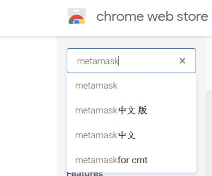

**Step 2:** Click "Add to Chrome" to install Metamask.

_Alternatively you can go directly to metamask.io to get the extension_.

**Step 3:** Accept the notification and click "Add extension" to install.

The install is complete when you see the Metamask fox logo on the upper right corner of your browser.

**Step 4:** Click the Metamask Fox logo on your browser and press Continue.

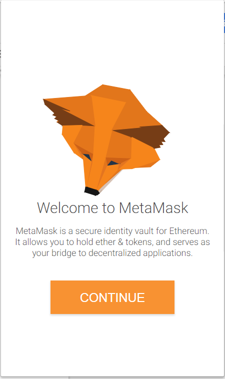

**Step 5:** Create your Metamask password.

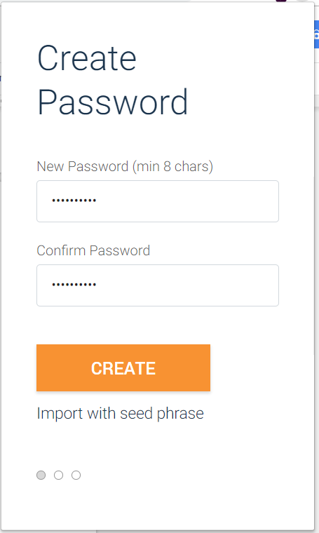

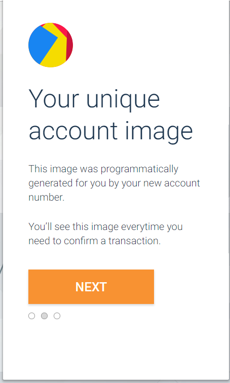

Metamask shows you your unique account image (as above.)

**Step 6:** Read and Accept the Terms of Use and Privacy Notice.

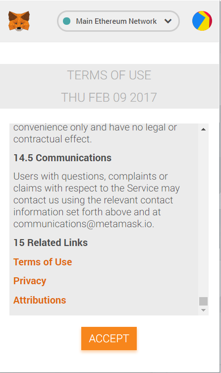

**Step 7:** Reveal your Secret Back up Phrase and Save it then press _Next_.

**NOTE:** You must save your Secret Back up Phrase on your hard drive, flash drive AND write it down on paper too. It's the only way to get back into your Metamask account.

**Step 8:** Confirm your Secret Back up Phrase and click _Confirm_.

You are now on the Ethereum Main Network.

## Adding ETH to a Test Account

To experiment with Metamask, select one of the test networks like _Ropsten_, _Kovan_, or _Rinkeby_. For this example use _Ropsten_.

**Step 1:** Click on _Deposit_ to add tokens to your test account.

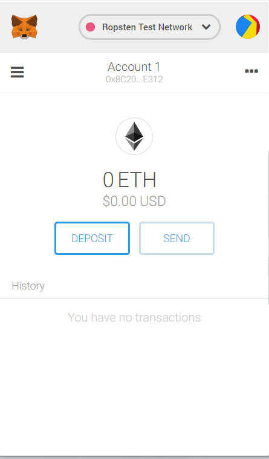

**Step 2:** Click _Get Ether from the Test Faucet_.

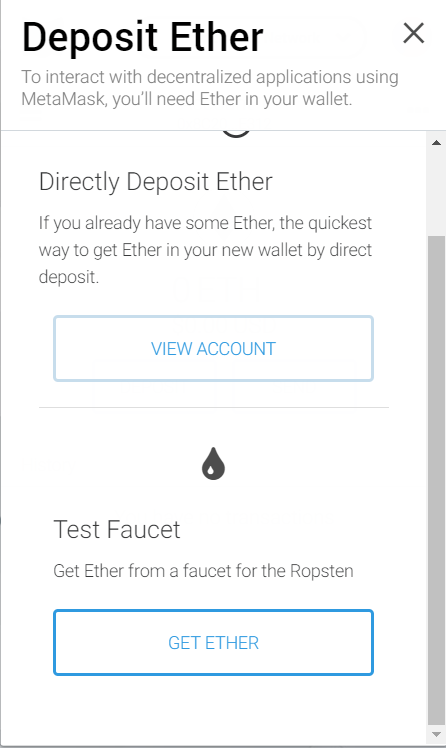

**Step 3:** Click _Request 1 Ether from Faucet_.

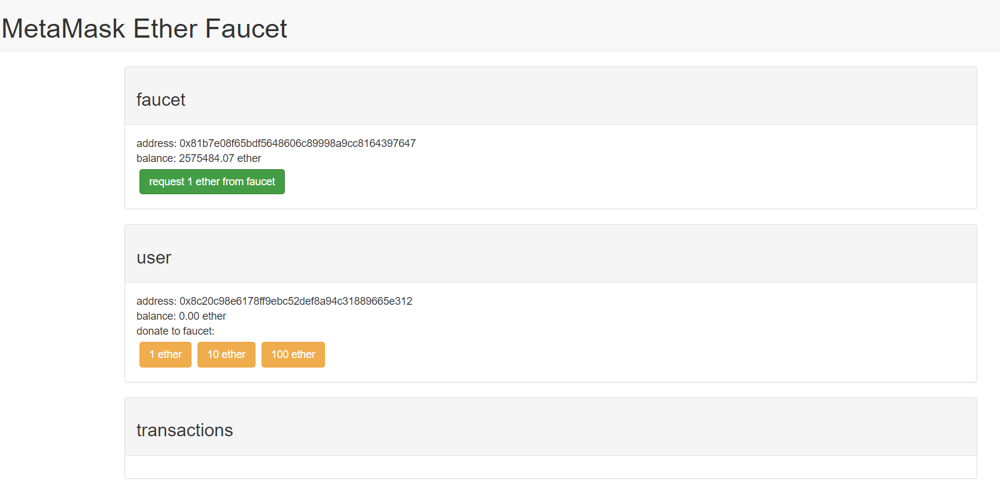

**Step 4:** Confirm the Metamask notification asking to connect the Test Ether Faucet to your account.

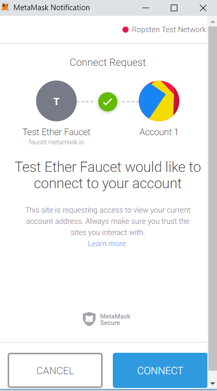

**Step 5:** View Transaction details and Account Balance.

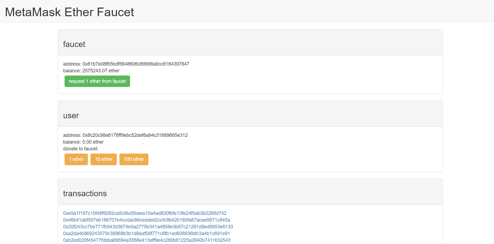

## Metamask's Interaction with a Web3 Application: Cryptokitties

There are various DApps to explore depending on your interest. For our example, we explore Metamask's interaction with Cryptokitties. Cryptokitties is a game created through blockchain technology that allows users to collect and breed cat-like creatures called "Cryptokitties."

**Step 1:** Go to [the Cryptokitties site](https://www.cryptokitties.co) and click on _Start Meow_.

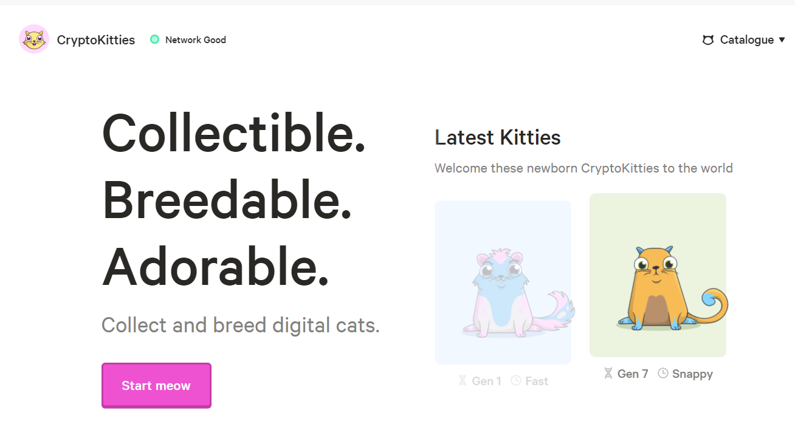

**Step 2:** Confirm the Metamask notification to Connect.

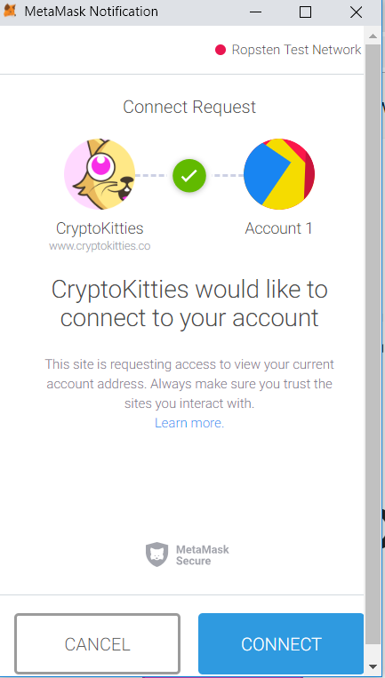

**Step 3:** Enter your email address and Nickname to create a CryptoKitties account.

**Step 4:** Accept the terms of the agreement and privacy policy to Sign Up.

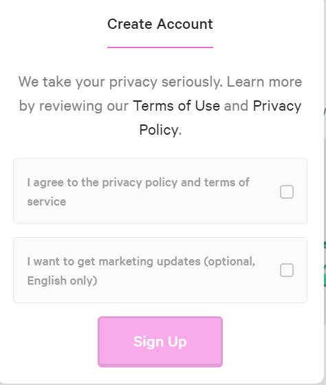

**Step 5:** Sign in to your wallet to digitally confirm the transaction and explore the CryptoKitty world!

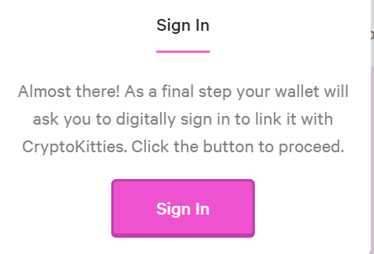

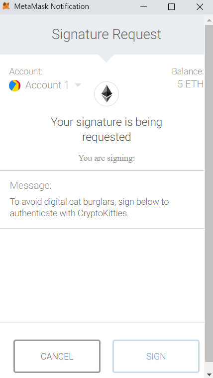
