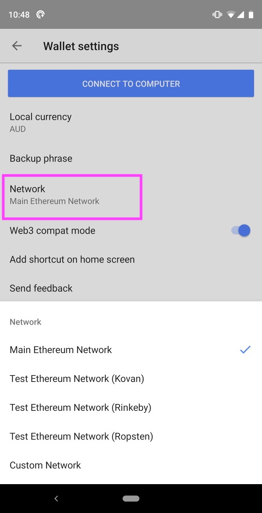

# Opera Wallet

A year or so ago I wanted to replace Google Chrome as my main browser. Why? First I was unsure and uncomfortable with the potential amount of data shared with Google. Second Chrome now reminds me too much of Internet Explorer in the 90s and early 2000s, where certain websites and features would only work in one browser, going against the entire concept of an "open internet".

I embarked on testing all of the alternative browsers to find one that suited me:

-   **[Firefox](https://www.mozilla.org/en-US/firefox/new/)**: I like that Firefox is open source, cross-platform, and syncs between installed versions, but on my Mac, it doesn't feel native enough for me, and at times looks kind of ugly.
-   [**Safari**](https://www.apple.com/safari/): Performant on a Mac, but I use an Android phone so sync isn't an option, and the extensions ecosystem is small.
-   [**Brave**](https://brave.com/): Again I liked the open source nature, but last time I checked, it also wasn't native looking on a Mac and Sync with mobile versions didn't work. I think Brave have now fixed some of these gripes, so maybe it's time I tried it again.

Then I hit upon Opera, which ticked all boxes for me, apart from its iOS versions (I also have an iPad I use for media consumption and creative work), which aren't great, probably due to restrictions in iOS. OK, it's closed source but has a well-established community and history. It also has built-in ad blocking and isn't afraid of trying features that other browsers don't.

Recent versions of Opera for Android bundled a crypto wallet, but I waited for desktop support before trying it properly and with the release of [version 60](https://blogs.opera.com/desktop/2019/04/opera-60-reborn-3-web-3-0-vpn-ad-blocker/) that arrived.

## Testing the Opera Crypto Wallet

First, disable Metamask, depending on the dapp you want to use, there may not be conflicts, but it reduces the chance there will be while you're testing things.

Enable the wallet in the desktop settings:

And mobile:

You can restore from an existing wallet by clicking _Restore from Backup_ and using your mnemonic phrase.

The mobile version of the wallet serves as the canonical wallet, and to have a wallet show in your desktop Opera; you need to connect the two by scanning a QR code. You can find a shortcut to the wallet in the desktop version of Chrome in the sidebar, which I don't use very much, but for now, this is the only way to show the wallet.

I did have some initial issues connecting the wallet, but updates seem to have resolved this.

There are a handful of settings for the wallet, all of which you find in the mobile version, for example, changing the network you connect to.

## Using the wallet

The wallet generally notifies you when you visit a web3 enabled website and triggers a notification on your phone if you are using the desktop version. Not all dapps work. For example, Kauri doesn't work with the Opera wallet (yet).

Here's an example of creating an account with CryptoKitties:

## What's next

The Opera wallet is limited but easy to use. It's [coming to iOS soon](https://blogs.opera.com/mobile/2019/03/opera-touch-ios-crypto-wallet/), and I hope for multiple account support. [Opera isn't the most popular browser with 3% of internet users](https://en.wikipedia.org/wiki/Usage_share_of_web_browsers), but that's still a lot of people, and maybe it's enough (combined with Brave users) to attract more mainstream users to web3 and dapps. What do you think?
